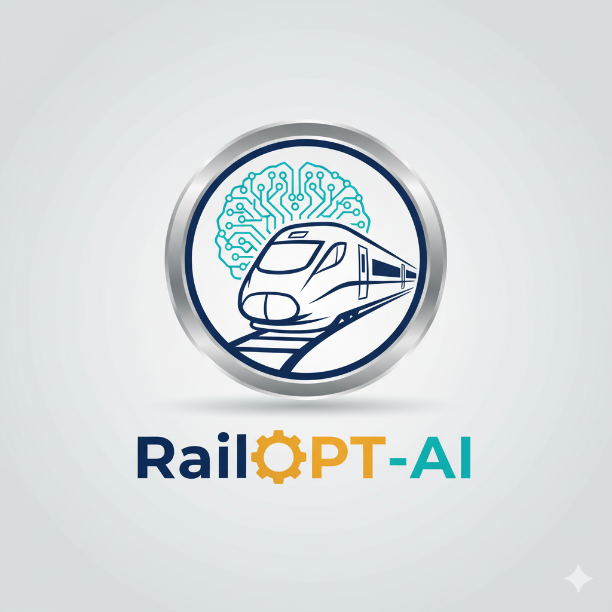

<p align="center">
  
</p>

<h1 align="center">AI-Powered Decision Support System for Indian Railways</h1>

<p align="center">
  <strong>A real-time, AI-driven dashboard for modernizing train traffic control in the Indian Railways.</strong>
</p>

<p align="center">
  
  
  
</p>

## Overview

This project is a sophisticated **Decision Support System (DSS)** designed for the train traffic controllers of the Indian Railways. It provides a comprehensive, at-a-glance operational overview, combining a live section map, real-time train monitoring, and proactive AI-driven recommendations. The system aims to enhance efficiency, minimize delays, and empower controllers to make smarter, data-driven decisions.

Built with Flutter, the application boasts a professional, elite UI inspired by modern control room aesthetics, ensuring a seamless experience across desktop, web, and mobile platforms.

---

## ✨ Key Features

-   **Multi-Page Dashboard**: A central hub for navigating between the main operational dashboard, in-depth KPIs, and a "what-if" Simulation Lab.
-   **Interactive Section Map**: A dynamic, circuit-board style visualization of the railway section, showing live train positions, station signals, and track occupancy.
-   **Comprehensive KPI Dashboard**: Professional data visualizations, including bar charts and trend indicators, to track key metrics like on-time performance, average delay, and operational efficiency.
-   **Live Train Monitoring**: A detailed panel to monitor all active trains, with filtering capabilities for "All," "Delayed," and "On-Time" trains.
-   **AI-Powered Chat Assistant**: An integrated chatbot for quickly querying train status, delays, and route information using natural language.
-   **Simulation Lab**: A "what-if" scenario planner that allows controllers to input hypothetical delays and visualize their potential impact on the network.
-   **Elite & Professional UI**: A meticulously crafted user interface with a consistent theme, custom widgets, and a focus on clarity and data density, suitable for a high-stakes control room environment.
-   **Expandable Architecture**: A clean, well-structured codebase that allows for easy integration of future modules like disruption handling, advanced analytics, and training scenarios.

---

## 📸 Screenshots

*(Add screenshots of your application here to showcase the UI)*

| Title Page | Main Dashboard |
| :---: | :---: |
| `[Screenshot of Title Page]` | `[Screenshot of Dashboard]` |

| KPI Page | Simulation Lab |
| :---: | :---: |
| `[Screenshot of KPI Page]` | `[Screenshot of Simulation Page]` |

---

## 🛠️ Technologies & Architecture

-   **Framework**: Flutter (Dart) for cross-platform development (Desktop, Web, Mobile).
-   **State Management**: Clean and localized state management using `StatefulWidget` and `setState`.
-   **UI/UX**:
    -   Custom theming to ensure a consistent and professional look inspired by Indian Railways branding.
    -   Advanced data visualization using the `fl_chart` package.
    -   Custom track and train rendering with `CustomPainter`.
-   **Architecture**:
    -   **Page-Based Navigation**: A multi-page structure with clear separation of concerns (`Dashboard`, `KPI`, `Simulation`).
    -   **Widget-Centric Design**: Reusable widgets for UI components like KPI cards, panels, and buttons.
    -   **Theming Engine**: Centralized theme files (`app_theme.dart`, `ir_theme.dart`) for easy styling adjustments.

---

## 🚀 Getting Started

Follow these steps to run the project on your local machine:

### Prerequisites

1.  **Flutter SDK**: Ensure you have Flutter installed. This project is built with Flutter 3.x.
2.  **IDE**: Android Studio or Visual Studio Code with the Flutter plugin.
3.  **Device/Emulator**: A connected device or a running emulator/simulator.

---

### Steps

1.  **Clone the repository**:
    ```bash
    git clone https://github.com/kumaraguru911/SIH25022.git
    cd SIH25022
    ```

2.  **Install dependencies**:
    ```bash
    flutter pub get
    ```

3.  **Run the app**:
    ```bash
    flutter run
    ```
    To run on a specific device (e.g., Chrome for web):
    ```bash
    flutter run -d chrome
    ```

---

## 📂 Project Structure

```
lib/
├── main.dart             # App entry point
├── app.dart              # Main MaterialApp widget and theme setup
├── theme/
│   ├── app_theme.dart    # High-level theme definitions (Light/Dark)
│   └── ir_theme.dart     # Detailed Indian Railways color and style constants
└── pages/
    ├── title_page.dart       # The initial splash/entry screen
    ├── dashboard_page.dart   # The main hub containing the core UI and navigation
    ├── kpi_page.dart         # The dedicated Key Performance Indicators screen
    ├── simulation_page.dart  # The "what-if" scenario simulation lab
    ├── chatbot_page.dart     # The AI assistant chat interface
    └── user_details_page.dart # The user profile page
```

---

## 🔮 Future Enhancements

-   **Real-time Data Integration**: Connect to live railway APIs or WebSockets for real train data instead of simulated movements.
-   **Advanced AI Models**: Implement machine learning models for more accurate delay prediction and optimized rerouting suggestions.
-   **Historical Playback**: Add a feature to "rewind" and analyze operational events from a specific time period.
-   **Light/Dark Theme Toggle**: Allow users to switch between themes for better accessibility in different lighting conditions.
-   **Authentication**: Implement a secure login system for controllers.

---

## 🤝 Contributing

Contributions are welcome! If you have ideas for improvements or want to fix a bug, please feel free to open an issue or submit a pull request.

1.  Fork the repository.
2.  Create your feature branch (`git checkout -b feature/AmazingFeature`).
3.  Commit your changes (`git commit -m 'Add some AmazingFeature'`).
4.  Push to the branch (`git push origin feature/AmazingFeature`).
5.  Open a Pull Request.

---

## 📄 License

This project is licensed under the MIT License - see the LICENSE file for details.

---

## 🙏 Acknowledgements

Designed with passion by **Hackitects** for the Indian Railways.
